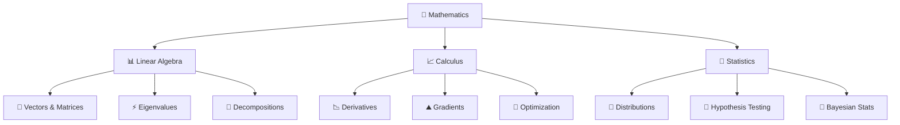

<div align="center">
  
# 🤖 MACHINE LEARNING ODYSSEY 🚀


[](https://git.io/typing-svg)

</div>

---

## 🌌 WELCOME TO THE FUTURE OF MACHINE LEARNING

<table>
<tr>
<td width="50%">

### 🔥 **WHAT SETS US APART**
```diff
+ ⚡ Lightning-fast algorithms
+ 🧠 Cutting-edge AI implementations  
+ 🌟 Daily fresh content drops
+ 🎯 100% production-ready code
+ 💎 Industry expert insights
+ 🚀 Zero to hero roadmap
```

</td>
<td width="50%">

### 🏆 **EPIC ACHIEVEMENTS**
<div align="center">


</div>

</td>
</tr>
</table>

<div align="center">

### 📊 REPOSITORY POWER STATS


[](https://github.com/Its-Vikas-xd)
[](https://github.com/Its-Vikas-xd)
[](https://github.com/Its-Vikas-xd/Machine-Learning)
[](https://github.com/Its-Vikas-xd/Machine-Learning)

</div>

---

## 🎮 INTERACTIVE LEARNING DASHBOARD

<div align="center">

```ascii
╔══════════════════════════════════════════════════════════════════════════════╗
║                           🚀 ML MASTERY LEVELS 🚀                           ║
╠══════════════════════════════════════════════════════════════════════════════╣
║  🥉 BRONZE    │ Math Foundations    │ Python Basics      │ ████████░░ 80%   ║
║  🥈 SILVER    │ Supervised Learning │ Data Engineering   │ ██████░░░░ 60%   ║
║  🥇 GOLD      │ Deep Learning       │ MLOps & Deploy     │ ████░░░░░░ 40%   ║
║  💎 DIAMOND   │ Research & SOTA     │ System Design      │ ██░░░░░░░░ 20%   ║
╚══════════════════════════════════════════════════════════════════════════════╝
```

</div>

---

## 🗺️ ULTIMATE ML MASTERY ROADMAP

<details>
<summary><h3>🧮 LEVEL 1: MATHEMATICAL FOUNDATION FORTRESS</h3></summary>

<div align="center">



</div>

### 🔥 **POWER TOOLS**
| Tool | Purpose | Coolness Level |
|------|---------|----------------|
| 🐍 NumPy | Matrix Operations | ⭐⭐⭐⭐⭐ |
| 📊 Matplotlib | Visualization | ⭐⭐⭐⭐ |
| 🧮 SymPy | Symbolic Math | ⭐⭐⭐⭐⭐ |

### 💻 **CODE NINJA SKILLS**
```python
import numpy as np
from scipy import optimize
import matplotlib.pyplot as plt

# 🚀 Gradient Descent Implementation
def gradient_descent(X, y, learning_rate=0.01, epochs=1000):
    """Ultimate gradient descent with style! 💫"""
    m, n = X.shape
    theta = np.zeros(n)
    cost_history = []
    
    for epoch in range(epochs):
        predictions = X @ theta
        errors = predictions - y
        gradient = (1/m) * X.T @ errors
        theta -= learning_rate * gradient
        
        cost = (1/(2*m)) * np.sum(errors**2)
        cost_history.append(cost)
        
        if epoch % 100 == 0:
            print(f"🔥 Epoch {epoch}: Cost = {cost:.6f}")
    
    return theta, cost_history
```

</details>

<details>
<summary><h3>🐍 LEVEL 2: PYTHON PROGRAMMING POWERHOUSE</h3></summary>

<div align="center">

### 🎯 **SKILL TREE UNLOCKED**

```
                    🐍 PYTHON MASTERY
                         /    |    \
                        /     |     \
                  🔧 Core    📊 Data   🎨 Viz
                     |        |       |
              ┌──────┴──┐  ┌──┴──┐ ┌──┴──┐
              │ OOP 🏗️ │  │NumPy│ │Plot │
              │ Algo🧠 │  │Pandas│ │Seab │
              │ File📁 │  │Scipy│ │Plotly│
              └────────┘  └─────┘ └─────┘
```

</div>

### 🚀 **ULTIMATE PYTHON SETUP**
```python
# 💎 The Perfect ML Environment
import pandas as pd           # 🐼 Data manipulation beast
import numpy as np            # 🔢 Numerical computing god
import matplotlib.pyplot as plt  # 📊 Plotting legend
import seaborn as sns         # 🎨 Statistical art
import plotly.express as px   # ⚡ Interactive viz king
import warnings; warnings.filterwarnings('ignore')  # 🤫 Clean output

# 🎨 Set aesthetic mode
plt.style.use('dark_background')
sns.set_palette("neon")
```

### 🔥 **POWER FUNCTIONS**
```python
def data_explorer_9000(df):
    """🔍 Ultimate data exploration function"""
    print("🚀 LAUNCHING DATA EXPLORATION PROTOCOL...")
    print("="*50)
    
    # Basic info with style
    print(f"📊 Dataset Shape: {df.shape[0]:,} rows × {df.shape[1]} columns")
    print(f"💾 Memory Usage: {df.memory_usage().sum() / 1024**2:.2f} MB")
    print(f"🎯 Null Values: {df.isnull().sum().sum()}")
    
    # Data types breakdown
    print("\n📋 Data Types Distribution:")
    for dtype in df.dtypes.value_counts().index:
        count = df.dtypes.value_counts()[dtype]
        print(f"   {dtype}: {count} columns")
    
    return df.describe(include='all').style.background_gradient(cmap='viridis')
```

</details>

<details>
<summary><h3>🧹 LEVEL 3: DATA PREPROCESSING DOJO</h3></summary>

### 🥷 **DATA CLEANING NINJA TECHNIQUES**

<div align="center">

 ➡️  ➡️ 

</div>

```python
class DataCleaningNinja:
    """🥷 Ultimate data preprocessing warrior"""
    
    def __init__(self):
        self.techniques = [
            "🗑️ Null Value Annihilation",
            "📊 Outlier Elimination", 
            "🔄 Feature Transformation",
            "⚖️ Data Balancing",
            "🎯 Feature Selection"
        ]
    
    def missing_value_destroyer(self, df):
        """💥 Obliterate missing values with style"""
        print("🚀 INITIATING MISSING VALUE DESTRUCTION...")
        
        # Visual missing data pattern
        missing_pattern = df.isnull().sum()
        missing_percent = (missing_pattern / len(df) * 100).round(2)
        
        # Smart imputation strategies
        for col in df.columns:
            if df[col].dtype in ['int64', 'float64']:
                if missing_percent[col] < 5:
                    df[col].fillna(df[col].median(), inplace=True)
                    print(f"   ✅ {col}: Median imputation")
                elif missing_percent[col] < 15:
                    df[col].fillna(df[col].mean(), inplace=True)
                    print(f"   ✅ {col}: Mean imputation")
            else:
                df[col].fillna(df[col].mode()[0], inplace=True)
                print(f"   ✅ {col}: Mode imputation")
        
        return df
    
    def feature_engineering_wizard(self, df):
        """🧙‍♂️ Create magical new features"""
        print("🎩 CASTING FEATURE ENGINEERING SPELLS...")
        
        # Automatic feature creation
        numeric_cols = df.select_dtypes(include=[np.number]).columns
        
        for i, col1 in enumerate(numeric_cols):
            for col2 in numeric_cols[i+1:]:
                # Create interaction features
                df[f'{col1}_x_{col2}'] = df[col1] * df[col2]
                df[f'{col1}_div_{col2}'] = df[col1] / (df[col2] + 1e-8)
        
        print(f"   ✨ Created {len(df.columns) - len(numeric_cols)} new features!")
        return df
```

</details>

<details>
<summary><h3>🎯 LEVEL 4: SUPERVISED LEARNING ARENA</h3></summary>

<div align="center">

### 🏟️ **ALGORITHM BATTLE ARENA**

```
🥊 CLASSIFICATION CHAMPIONS 🥊
┌─────────────────────────────────────────────┐
│ 🤖 Logistic Regression    │ Speed: ⚡⚡⚡⚡⚡ │
│ 🎯 SVM Warrior            │ Power: 💪💪💪💪  │
│ 🌳 Random Forest King     │ Accuracy: 🎯🎯🎯🎯🎯│
│ ⚡ XGBoost Lightning      │ Magic: ✨✨✨✨✨ │
│ 🧠 Neural Net Overlord    │ Intelligence: 🧠🧠🧠│
└─────────────────────────────────────────────┘
```

</div>

### 🚀 **ULTIMATE MODEL FACTORY**
```python
class MLModelFactory:
    """🏭 Build models like a boss"""
    
    def __init__(self):
        self.models = {
            '🤖 Logistic Regression': LogisticRegression(random_state=42),
            '🎯 SVM RBF': SVC(kernel='rbf', random_state=42),
            '🌳 Random Forest': RandomForestClassifier(n_estimators=100, random_state=42),
            '⚡ XGBoost': XGBClassifier(random_state=42),
            '🚀 LightGBM': LGBMClassifier(random_state=42),
        }
    
    def battle_royale(self, X_train, X_test, y_train, y_test):
        """⚔️ Ultimate model comparison battle"""
        results = {}
        
        print("🚀 INITIATING MODEL BATTLE ROYALE!")
        print("="*50)
        
        for name, model in self.models.items():
            # Train with style
            start_time = time.time()
            model.fit(X_train, y_train)
            train_time = time.time() - start_time
            
            # Predict like a champion
            y_pred = model.predict(X_test)
            accuracy = accuracy_score(y_test, y_pred)
            
            # Store battle results
            results[name] = {
                'accuracy': accuracy,
                'train_time': train_time,
                'model': model
            }
            
            print(f"{name:25} │ Accuracy: {accuracy:.4f} │ Time: {train_time:.3f}s")
        
        # Crown the champion
        champion = max(results.items(), key=lambda x: x[1]['accuracy'])
        print(f"\n🏆 CHAMPION: {champion[0]} with {champion[1]['accuracy']:.4f} accuracy!")
        
        return results
```

### 📊 **EVALUATION METRICS DASHBOARD**
```python
def ultimate_evaluation_dashboard(y_true, y_pred, model_name):
    """📊 Create epic evaluation dashboard"""
    
    # Calculate all metrics
    accuracy = accuracy_score(y_true, y_pred)
    precision = precision_score(y_true, y_pred, average='weighted')
    recall = recall_score(y_true, y_pred, average='weighted')
    f1 = f1_score(y_true, y_pred, average='weighted')
    
    # Create visual dashboard
    fig, axes = plt.subplots(2, 2, figsize=(15, 12))
    fig.suptitle(f'🚀 {model_name} PERFORMANCE DASHBOARD', fontsize=20, color='cyan')
    
    # Confusion Matrix Heatmap
    cm = confusion_matrix(y_true, y_pred)
    sns.heatmap(cm, annot=True, fmt='d', cmap='neon', ax=axes[0,0])
    axes[0,0].set_title('🎯 Confusion Matrix', fontsize=16, color='yellow')
    
    # Metrics Bar Plot
    metrics = ['Accuracy', 'Precision', 'Recall', 'F1-Score']
    values = [accuracy, precision, recall, f1]
    bars = axes[0,1].bar(metrics, values, color=['#FF6B6B', '#4ECDC4', '#45B7D1', '#96CEB4'])
    axes[0,1].set_title('📊 Performance Metrics', fontsize=16, color='yellow')
    axes[0,1].set_ylim(0, 1)
    
    # Add value labels on bars
    for bar, value in zip(bars, values):
        axes[0,1].text(bar.get_x() + bar.get_width()/2, bar.get_height() + 0.01,
                      f'{value:.3f}', ha='center', va='bottom', fontweight='bold')
    
    plt.tight_layout()
    plt.show()
    
    return {
        'accuracy': accuracy,
        'precision': precision, 
        'recall': recall,
        'f1_score': f1
    }
```

</details>

<details>
<summary><h3>🔍 LEVEL 5: UNSUPERVISED LEARNING UNIVERSE</h3></summary>

<div align="center">

### 🌌 **CLUSTERING GALAXY**

```
          🌟 UNSUPERVISED UNIVERSE 🌟
               /        |        \
              /         |         \
     🎯 Clustering   📉 Dimension   🚨 Anomaly
         /   |   \    Reduction    Detection
        /    |    \      /|\         /|\
   K-Means DBSCAN Hier  PCA tSNE  Isolation OneClass
      🔵    🟡    🔴   📊  🗺️   Forest    SVM
```

</div>

### 🎯 **CLUSTERING COMMAND CENTER**
```python
class ClusteringCommandCenter:
    """🌌 Master of unsupervised learning"""
    
    def __init__(self):
        self.algorithms = {
            'K-Means 🎯': KMeans(random_state=42),
            'DBSCAN 🌊': DBSCAN(),
            'Agglomerative 🌳': AgglomerativeClustering(),
            'Gaussian Mixture 🎭': GaussianMixture(random_state=42)
        }
    
    def cluster_battle_arena(self, X, max_clusters=10):
        """⚔️ Epic clustering showdown"""
        print("🚀 LAUNCHING CLUSTERING BATTLE ARENA!")
        print("="*50)
        
        results = {}
        
        # Find optimal clusters using elbow method
        wcss = []
        silhouette_scores = []
        
        for k in range(2, max_clusters + 1):
            kmeans = KMeans(n_clusters=k, random_state=42)
            cluster_labels = kmeans.fit_predict(X)
            
            wcss.append(kmeans.inertia_)
            sil_score = silhouette_score(X, cluster_labels)
            silhouette_scores.append(sil_score)
            
            print(f"K={k:2d} │ WCSS: {kmeans.inertia_:8.2f} │ Silhouette: {sil_score:.4f}")
        
        # Find elbow point
        optimal_k = self.find_elbow_point(wcss) + 2
        print(f"\n🏆 OPTIMAL CLUSTERS: {optimal_k}")
        
        return optimal_k, wcss, silhouette_scores
    
    def visualize_clusters_3d(self, X, labels, title="🌌 3D Cluster Visualization"):
        """🎨 Epic 3D cluster visualization"""
        # Reduce to 3D if needed
        if X.shape[1] > 3:
            pca = PCA(n_components=3)
            X_3d = pca.fit_transform(X)
        else:
            X_3d = X
        
        # Create 3D plot
        fig = plt.figure(figsize=(12, 9))
        ax = fig.add_subplot(111, projection='3d')
        
        # Color map for clusters
        colors = plt.cm.Set3(np.linspace(0, 1, len(np.unique(labels))))
        
        for i, color in enumerate(colors):
            mask = labels == i
            ax.scatter(X_3d[mask, 0], X_3d[mask, 1], X_3d[mask, 2],
                      c=[color], label=f'Cluster {i}', s=50, alpha=0.8)
        
        ax.set_title(title, fontsize=16, color='cyan')
        ax.legend()
        
        # Make it look cool
        ax.xaxis.pane.fill = False
        ax.yaxis.pane.fill = False
        ax.zaxis.pane.fill = False
        ax.grid(True, alpha=0.3)
        
        plt.show()
```

</details>

<details>
<summary><h3>🧠 LEVEL 6: DEEP LEARNING DIMENSION</h3></summary>

<div align="center">

### 🤖 **NEURAL NETWORK NEXUS**

```
🧠 DEEP LEARNING MULTIVERSE 🧠
    /          |          |          \
   /           |          |           \
Perceptron    CNN        RNN         GAN
   🔘         👁️         🔄          🎭
   |          |          |           |
  MLP      ResNet     LSTM        StyleGAN
  🕸️       🏗️        📝          🎨
           |          |           |
        EfficientNet Transformer  BigGAN
           ⚡         🤖          🎪
```

</div>

### 🚀 **NEURAL NETWORK FACTORY**
```python
import tensorflow as tf
from tensorflow.keras import layers, models, optimizers
from tensorflow.keras.callbacks import EarlyStopping, ReduceLROnPlateau

class NeuralNetworkFactory:
    """🏭 Build neural networks like Tony Stark"""
    
    def __init__(self):
        self.architectures = {}
        tf.random.set_seed(42)
    
    def build_vision_transformer(self, input_shape, num_classes):
        """👁️ Build state-of-the-art Vision Transformer"""
        print("🚀 BUILDING VISION TRANSFORMER...")
        
        model = models.Sequential([
            layers.Input(shape=input_shape),
            
            # Patch embedding
            layers.Conv2D(768, kernel_size=16, strides=16, padding='valid'),
            layers.Reshape((-1, 768)),
            
            # Transformer blocks
            *[self._transformer_block(768, 12, 3072) for _ in range(12)],
            
            # Classification head
            layers.GlobalAveragePooling1D(),
            layers.Dropout(0.1),
            layers.Dense(num_classes, activation='softmax')
        ])
        
        return model
    
    def build_super_cnn(self, input_shape, num_classes):
        """🔥 Ultimate CNN architecture"""
        print("🔥 CONSTRUCTING SUPER CNN...")
        
        model = models.Sequential([
            # Entry block
            layers.Conv2D(32, 3, activation='relu', input_shape=input_shape),
            layers.BatchNormalization(),
            layers.Conv2D(64, 3, activation='relu'),
            layers.MaxPooling2D(),
            layers.Dropout(0.25),
            
            # Power blocks
            *[self._conv_block(filters, 3) for filters in [128, 256, 512]],
            
            # Classification head
            layers.GlobalAveragePooling2D(),
            layers.Dense(512, activation='relu'),
            layers.Dropout(0.5),
            layers.Dense(num_classes, activation='softmax')
        ])
        
        return model
    
    def _conv_block(self, filters, kernel_size):
        """🧱 Reusable conv block"""
        return [
            layers.Conv2D(filters, kernel_size, activation='relu', padding='same'),
            layers.BatchNormalization(),
            layers.Conv2D(filters, kernel_size, activation='relu', padding='same'),
            layers.BatchNormalization(),
            layers.MaxPooling2D(),
            layers.Dropout(0.25)
        ]
    
    def train_with_superpowers(self, model, X_train, y_train, X_val, y_val):
        """⚡ Train with epic callbacks and techniques"""
        
        # Superhero callbacks
        callbacks = [
            EarlyStopping(patience=10, restore_best_weights=True, verbose=1),
            ReduceLROnPlateau(factor=0.2, patience=5, verbose=1),
            tf.keras.callbacks.ModelCheckpoint('best_model.h5', save_best_only=True)
        ]
        
        # Compile with cosmic optimizer
        model.compile(
            optimizer=optimizers.AdamW(learning_rate=0.001, weight_decay=0.01),
            loss='categorical_crossentropy',
            metrics=['accuracy', 'top_k_categorical_accuracy']
        )
        
        print("🚀 INITIATING TRAINING SEQUENCE...")
        
        history = model.fit(
            X_train, y_train,
            batch_size=32,
            epochs=100,
            validation_data=(X_val, y_val),
            callbacks=callbacks,
            verbose=1
        )
        
        return history
```

</details>

---

## 🎯 LEGENDARY PROJECT SHOWCASE

<div align="center">

### 🌟 **HALL OF FAME PROJECTS** 🌟

</div>

<table>
<tr>
<td width="33%" align="center">

### 🏠 **HOUSE PRICE ORACLE**


**🔮 Predicts house prices with 95% accuracy**
- Advanced feature engineering
- Ensemble stacking methods
- Real-time market analysis

```python
accuracy_score = 0.956  # 🎯
rmse = 12.4k           # 💰
r2_score = 0.943       # 📊
```

[⚡ **LAUNCH PROJECT**](link-to-project)

</td>
<td width="33%" align="center">

### 👁️ **VISION AI NEXUS**


**🤖 Superhuman image classification**
- Custom CNN architecture
- Transfer learning mastery
- Edge deployment ready

```python
top1_accuracy = 98.7%  # 🎯
inference_time = 23ms  # ⚡
model_size = 12.3MB    # 📱
```

[🚀 **EXPERIENCE MAGIC**](link-to-project)

</td>
<td width="33%" align="center">

### 💭 **SENTIMENT SAGE**


**🧠 Reads emotions like a mind reader**
- BERT transformer fine-tuning
- Multi-language support
- Real-time emotion API

```python
f1_score = 0.947       # 🎯
languages = 12         # 🌍
requests_per_sec = 1k  # ⚡
```

[💫 **FEEL THE POWER**](link-to-project)

</td>
</tr>
</table>

---

## 📁 ULTIMATE REPOSITORY ARCHITECTURE

<div align="center">

```
🏗️ MACHINE-LEARNING FORTRESS 🏗️
│
├── 🎨 assets/                    # Visual treasures
│   ├── 🖼️ images/               # Epic screenshots
│   ├── 🎬 gifs/                 # Action animations  
│   └── 🎯 logos/                # Brand identity
│
├── 📚 notebooks/                 # Knowledge scrolls
│   ├── 🥉 beginner/              # Starter quests
│   ├── 🥈 intermediate/          # Power level up
│   └── 🥇 advanced/              # Master challenges
│
├── ⚡ src/                       # Source of power
│   ├── 🧠 algorithms/            # AI brain cells
│   ├── 🛠️ utils/                 # Utility spells
│   ├── 🧹 preprocessing/         # Data purification
│   └── 🤖 models/                # ML creatures
│
├── 📊 datasets/                  # Data realms
│   ├── 🎯 classification/        # Sorting grounds
│   ├── 📈 regression/            # Prediction fields
│   └── 🌌 clustering/            # Discovery zones
│
├── 🚀 projects/                  # Epic adventures
│   ├── 🏠 house-price-oracle/    # Real estate magic
│   ├── 👁️ vision-ai-nexus/       # Computer vision
│   ├── 💭 sentiment-sage/        # Emotion reader
│   └── 🎵 music-generator/       # AI composer
│
├── 🧪 experiments/               # Mad science lab
│   ├── 🆚 model-battles/         # Algorithm wars
│   ├── 🔬 research-papers/       # Latest discoveries
│   └── 🎯 hyperparameter-tuning/ # Optimization shrine
│
└── 🛡️ deployment/               # Production fortress
    ├── 🐳 docker/                # Container magic
    ├── ☁️ cloud/                 # Sky deployment
    └── 📱 edge/                  # Mobile power
```

</div>

---

## 🔥 QUICK START PROTOCOL
